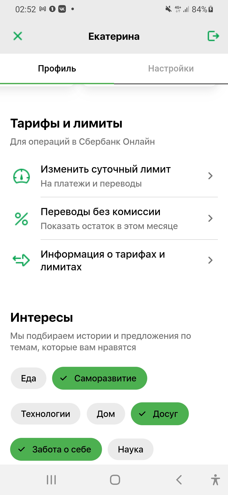

# sber_app_filyakin

## Filyakin Artem, OmSTU

This Flutter project present simple UI of prototype of the Sberbank application. Screenshots from other devices enclosed.

## Versions of used tools

Flutter (Channel stable, 3.16.2, on Microsoft Windows [Version 10.0.19045.3448], locale ru-RU)

    • Framework revision 9e1c857886 (7 days ago), 2023-11-30 11:51:18 -0600
    
    • Engine revision cf7a9d0800

    • Dart version 3.2.2

    • DevTools version 2.28.3

    • Tested mostly on Samsung A40, also on web 
    (Microsoft Edge) and on Pixel 6 Emulator

## Screenshots from Pixel 6 Pro API 33

## Screenshots from Edge iPhone XR

## Screenshots from Samsung A40

On these pictures green have another color because these screenshot have been made a day before another screenshots and I replaced color in ColorPalete.

